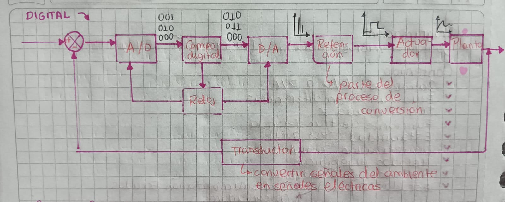
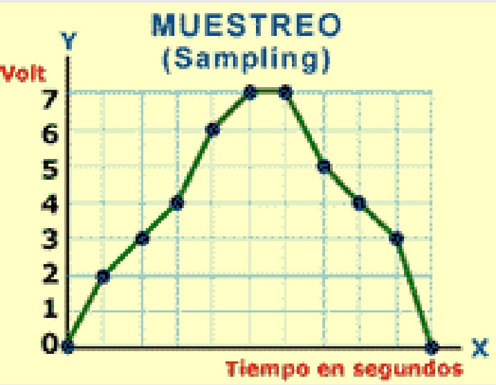
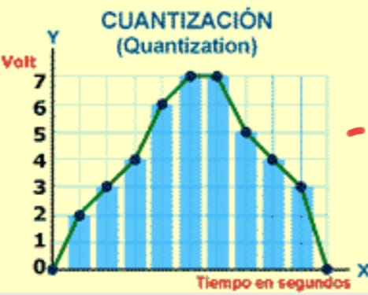
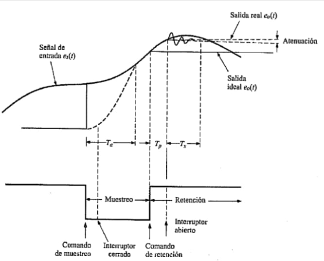
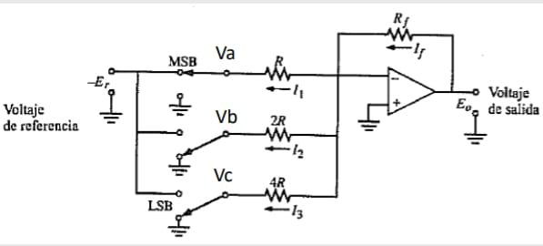
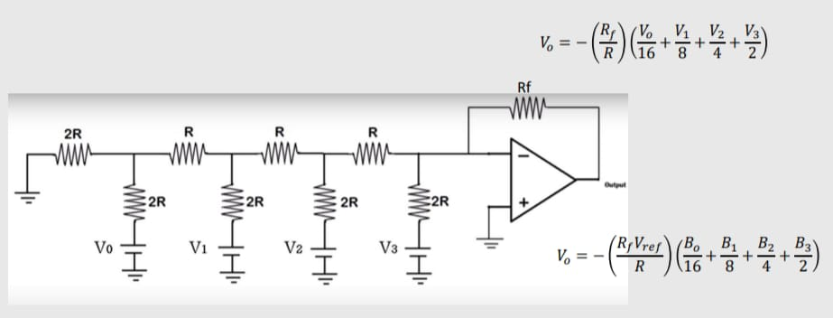

01/08/2024
# Señales Analógicas y Digitales y convertidores ADC y DAC 
En el campo de la electrónica, la adquisición y generación de señales es fundamental para comprender y analizar el comportamiento de variables que percibimos tanto de manera tangible como a través de nuestros sentidos. Estas señales se dividen en las señales naturales que no siempre son generadas por el ser humano y representan medidas de variables físicas, como la temperatura, la humedad o la presión. Por otro lado, las señales digitales son creadas por el ser humano y toman valores lógicos, como "1" o "0". Ambas categorías de señales son cruciales tanto para la electrónica como para la vida cotidiana.
Para conectar el mundo analógico con el digital, se han desarrollado convertidores ADC (Analog-to-Digital Converter) y DAC (Digital-to-Analog Converter). Estos dispositivos actúan como un puente, transformando señales físicas en datos digitales que pueden ser utilizados por sistemas electrónicos mucho más modernos.

## 1. Señales Analógicas y Digitales
### 1.1 Señales Análogicas: 
>🔑 Definición: Señal continua que puede tomar cualquier valor en el dominio del tiempo.
>🔑 Características: Es muy limitado, pero es más exacto que el digital.
### 1.2 Señales Digitales:
>🔑 Definición: Solo tiene 2 posibles valores o estados. Este tipo de señales tiene forma de onda cuadrada.

Características:

* La exactitud 📉 
* Errores de implementaciöm. 📈
* Flexibilidad (Solo necesita cambio de software).
* Velocidad (Tiempo real. más baja que la análoga). 📉 
* Costos (Más barata).

Figura 1. Estructura para control digital. Tomada de: https://aulas.ecci.edu.co/course/view.php?id=9304

## 2. Conversión Análoga a Digital
### 2.1 Procedimiento
#### 2.1.1 Muestreo: Medir valores de voltaje cada cierto tiempo (Poner rango en el tiempo)
* Se mide como el número de veces que se mide en 1 seg por lo tanto la unidad está dada en Hz.
* Entre más alta la tasa de muestreo, más información se está procesando.
* El muestreo puede ser periódico (único), de tasa múltiple o aleatorio.
  

Figura 2. Muestreo en una señal analoga. Tomado de: https://aulas.ecci.edu.co/course/view.php?id=9304

#### 2.1.2 Cuantización: Se convierte en una serie de valores que corresponden a cada una de las medidas tomadas en el muestreo 
* Los conversores vienen con una información que indica si tiene error de cuantización.
  

Figura 3. Cuantización de una señal analoga. Tomado de: https://aulas.ecci.edu.co/course/view.php?id=9304

#### 2.1.3 Codificación: Se asignan valores de tipo binario a cada uno de los valores del paso anterior (cuantización).
* Es importante la cantidad de bits que usará el código, es decir, los que se le van a configurar desde el inicio. Esto con el fin de que no haya desperdicio de memoria si se usan más bits de los necesarios.
* Tienen limitaciones de voltaje.

Figura 4. Codificación en una señal analoga. Tomado de: https://aulas.ecci.edu.co/course/view.php?id=9304

## 2.2 Consideraciones Prácticas
>🔑 Importante: En algunas señales hay que tener en cuenta los tiempos de retraso entre el muestreo y la cuantización del valor.

## 2.3 Tiempos de muestreador y retenedor

Figura 5. Señal del tiempo del muestrador. Tomado de: https://aulas.ecci.edu.co/course/view.php?id=9304

* Ta: Es el tiempo de adquisición, es decir, el tiempo que pasa desde que se inicia el muestreo hasta que se retiene dentro de cierto margen de tolerancia.
* Tp: Es el tiempo de apertura, lo que quiere decir que es el tiempo que pasa desde la retención hasta que se abre el muestreador.
* Ts: El movimiento constante del interruptor crea capacitancia parásita, un fenómeno que produce un estado transitorio en la señal de salida, por lo que Ts que significa tiempo de establecimiento es el tiempo que necesita la señal para que las oscilaciones desaparezcan.

## 💡'Ejemplo 1:'
### Se tienen los siguientes datos: 
* Señal analógica: [0.3]V
* Bits de representación: 2 bits
* $$2^{2}$$ = 4 posibles símbolos
* Rango analógico: 3-0=3V
* Representación: 3/4 = 0.75V
  
|  Voltaje  |  Binario  |
|---------------|---------------|
|       0       |      00       |
|     0.75      |      01       |
|      1.5      |      10       |
|      2.25     |      11       |

Tabla 1. Valores que se están cuantizando.

* Son $$2^{r}-1$$ posibles símbolos porque se toma el 0.
##💡'Ejemplo 2:'
### Para Arduino: 
* Señal analógica: [0.5]V
* Bits de representación: 10 bits
* $$2^{10}$$ = 1024 posibles símbolos
* Rango analógico: 5-0=5V
* Representación: 5/1024 = 4.88mV

## 3. Conversión Digital a Análogo
>🔑 ¿Qué es?: Dispositivo que genera una correspondencia uno a uno entre valores digitales y valores análogicos.
* La resolución depende de los bits de representación al igual que en los ADC. Para rango completo hay  $$2^{n}$$ valores analógicos que incluyen el 0
* FS (Fondo de escala): Máximo voltaje que se tendrá en el rango de conversión, se representa con el símbolo de %

| Bits entrada | Resolución (V) |Resolución(%FS)|
|------------------|--------------------|-------------------|
|        4         |         1          |      6.6          |
|        8         |       0.059        |      0.4          |
|       16         |      229x10^-6     |     0.0015        |
|       32         |      3.5x10^-9     |  0.00000000023    |

Tabla 2. Explicación del fondo de escala.

*Los bits a valor digital se multiplican por su potencia de 2. 
### 3.1 Métodos de conversión
#### 3.1.1 Resistencias Ponderadas: Está compuesto por una serie de resistencias ponderadas al peso binario de cada bit y en serie con un interruptor conectado al bit de dicho peso. $$S_{0}$$ a $$S_{N-1}$$ conectan cada resistencia a 2 posibles tensiones. 1. Son iguales, pero signo contrario: Saldrá una tensión simétrica. 2. Si una es positiva y la otra está conecta a tierra permitirá únicamente rangos positivos de señal de salida. 

Figura 6. Método de resistencias ponderadas. Tomado de: https://aulas.ecci.edu.co/course/view.php?id=9304

MSB= BIT más significativo.
LSB= BIT menos significativo. 
Rf= Permite fijar la tensión del fondo de escala.

* Cuando un bit es 0 no aportan corriente a la total Is mientras que los "1" aportan diferentes corrientes dependiendo del peso.
* Se analiza entonces la siguiente ecuación para obtener el valor de Vout:

$$V_{0}=-I_{f}R_{f}= \frac{Vref*R_{f}}{R}(a_{N-1}+a_{N-2}\frac{1}{2}+...+a_{0}\frac{1}{2^{N-1}})$$
  
*Donde $$a_{}$$ son bits de entrada.
*La anterior ecuación se puede resumir en :

$$V_{0}=\frac{-n*Vref}{2^{N-1}}$$

*Donde N son el número de bits que se están trabajando y n es el valor digital.

# 📚'Ejercicios'
## 1. Se tiene la siguiente información: 
$$N=8$$
$$Vref=-1V$$

Entonces se tiene que con: 
* $$n=128$$

 $$V_{0}= \frac{-128*-1}{2^{8-1}}= 1V$$
  
* $$n=0$$
  
$$V_{0}= \frac{-0*-1}{2^{8-1}}= 0V$$

* Los demás valores están dentro del rango de 0V a 1V.
>🔑 Desventaja: Es difícil tener "n" resistencia que sigan una progresión geométrica y una precisión buena.

#### 3.1.2 Red en escalera R-2R (Complicado de configurar pero es más exacto)

Figura 7. Modelo R2R. Tomado de: https://aulas.ecci.edu.co/course/view.php?id=9304

*Nunca se tiene Vout=Vcc aunque se hagan muchas sumas parciales 
>🔑 Desventaja: Hay relación de resistencias que afectan la tolerancia de las mismas. Además de ello a veces hay que poner FILTROS para no observar saltos de tensión (escalones), pero limita la Freq máxima que se puede obtener.

## 4. Modelo matemático conversores A/D y D/A
* Utilizan mismos componentes. Muestreador y retenedor.
* El muestreador se analiza idealmente con una señal de reloj e interruptor.
* El retenedor se puede modelar con un sistema que contenga una función de transferencia.
  
## 5. Consideraciones 
*Asumiendo que el conversor DAC sea:
1. Las entradas y las salidas del conversor tienen igual magnitud.
2. La conversión se realiza de forma instantanea.
3. Las salidas son constantes sobre el periodo de muestreo.
   Se obtiene entonces:
### 5.1 Zero Order Hold (ZOH)

Figura 8. Función de Transferenica Zero Order Hold. Tomado de: https://aulas.ecci.edu.co/course/view.php?id=9304

Figura 9. Muestra Zero Order Hold y First Order Hold. Tomado de: https://aulas.ecci.edu.co/course/view.php?id=9304

* Subir la retención, implica un incremento en el costo del conversor.
### 5.2 First Order Hold (FOH)
>🔑 Ventaja: Toma más valores, es decir, puede tener un análisis de más información ya que tiene un modelo lineal.
### 5.3 Second Order Hold (SOH)
>🔑 Ventaja: Modelo parabólico durante intervalo de muestreo.

## 6. Conclusiones
El objetivo fundamental de un conversor es servir como un puente entre el mundo digital y el analógico. Esta responsabilidad implica que los procesos de conversión sean precisos para evitar la pérdida de información crucial. No obstante, es esencial encontrar un equilibrio, ya que cada componente del sistema influye en el resultado final. Por ejemplo, un mayor número de bits permite representar más información, pero también aumenta la complejidad del diseño del circuito y su interpretación. Asimismo, una alta resolución eleva la complejidad tanto del diseño del circuito como de su comprensión. Con esto en cuenta ya el manejo de estos conversores será algo útil por si se desea trabajar en sistemas de manejo de señales como audio o video o simplemente en el control industrial. 
  
##  Referencias
[1]“AulasVirtualesECCI: Entrar al sitio,” Edu.co. [Online]. Available: https://aulas.ecci.edu.co/course/view.php?id=9304. [Accessed: 10-Aug-2024].
[2] FabioLeon, “¿Qué son señales analógicas y digitales en electrónica?,” DynamoElectronics, 13-Jul-2022. [Online]. Available: https://www.dynamoelectronics.com/que-son-senales-analogicas-y-digitales-en-electronica/. [Accessed: 09-Aug-2024].
[3] “DAC Con Resistencias Ponderadas,” Scribd. [Online]. Available: https://es.scribd.com/document/343360980/DAC-Con-Resistencias-Ponderadas. [Accessed: 10-Aug-2024].
[4] V. T. las E. De msavalos, “¿Cómo funciona un Conversor Digital-Analógico (DAC) R2R?,” Electrónica + Programación + GNU/Linux, 19-Jan-2021. [Online]. Available: https://electronlinux.wordpress.com/2021/01/19/como-funciona-un-conversor-digital-analogico-dac-r2r/. [Accessed: 10-Aug-2024].
